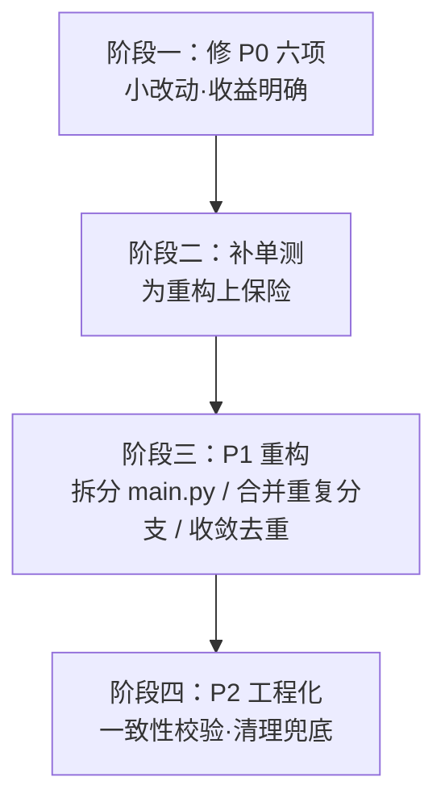

# CosyVoice 插件代码审查报告

- **审查日期**：2026-09-09
- **审查版本**：`metadata.yaml` → `v2.1.46`
- **审查范围**：`main.py`、`core/`（`tts_engine` / `webapi` / `markup` / `translator`）、`cosyvoice/`（`client` / `router`）、`utils/audio.py`、`metadata.yaml`
- **审查方式**：全量通读核心模块 + 关键路径代码走查（钩子链路、去重链路、合成链路、持久化链路）

## 一、整体评价

功能完整度与注释质量均属上乘：文本净化（媒体占位符 / 工具调用 / 代码块 / 思考标记）、分段策略（窗口 + 换行优先 + 短段合并）、服务端熔断与多节点分流、翻译适配、WebUI 管理面都已覆盖，且关键决策都留了注释说明「为什么这样做」。

主要问题集中在**迭代到 v2.1.46 后堆积的缺陷与结构债**：

1. 有 1 处真实资源泄漏（旧 client 未 await 关闭）；
2. 有 1 个「死配置」（`tts_context_hint` 从未实现）连带 1 处虚假文案；
3. 有 3 处资源 / 性能隐患（翻译缓存无界、参考音频重复读盘、预览文件不清理）；
4. `main.py` 2008 行已成 God class，且后台发送存在 4 处复制粘贴分支；
5. 项目零测试，而历史迭代（v2.1.34 → v2.1.46）大量是回归修复，回归风险高。

## 二、项目结构现状

| 文件 | 行数 | 职责 | 状态 |
| --- | --- | --- | --- |
| `main.py` | 2008（116.7 KB） | 状态 / 去重 / 钩子 / 后台发送 / 指令 / LLM 工具 / 持久化 | ⚠️ 严重过大 |
| `core/tts_engine.py` | 715 | 音色解析、文本净化、分段、合成编排 | ✅ 良好 |
| `core/webapi.py` | 606 | WebUI 后端 API | ⚠️ 有清理遗漏 |
| `core/translator.py` | 239 | 可配置翻译适配器 | ⚠️ 缓存无界 |
| `core/markup.py` | 209 | 副语言标记注入 | ✅ 良好 |
| `cosyvoice/client.py` | 291 | 单节点 HTTP 客户端 | ⚠️ 重复读盘 |
| `cosyvoice/router.py` | 256 | 多节点负载均衡 | ⚠️ close 未 await |
| `utils/audio.py` | 71 | PCM → WAV、临时文件清理 | ✅ 良好 |

## 三、问题清单

### P0-1 `cosyvoice/router.py`：旧 client 从未真正关闭（连接泄漏）

**位置**：`cosyvoice/router.py:122-127`

```python
for old in self._nodes:
    try:
        old["client"].close()
    except Exception:
        pass
```

`CosyVoiceClient.close()` 是 `async def`（`client.py:288`），此处同步调用且未 `await`，仅创建协程对象后丢弃：

- 旧 httpx 连接池**从未关闭**，每次配置热更泄漏一批连接；
- 必然刷 `coroutine ... was never awaited` 警告。

**建议**：把 `_rebuild` 改为 `async`，或 `asyncio.create_task(old["client"].close())`。

### P0-2 `tts_context_hint` 为死配置 + `voice_only` 虚假文案

**位置**：`metadata.yaml:264`（配置声明）、`main.py:1743`（文案）

`metadata.yaml` 声明了「发语音成功后把本轮内容补回会话上下文」，但 `main.py` 全文**没有任何读取 / 实现该配置的代码**（已检索 `tts_context_hint` / `已用语音播报` / `set_result` / `role=assistant` 均无）。

同时 `/tts_type 0` 的提示文案承诺了该未实现功能：

```python
"好嘞，这个聊天以后只发语音～（文字仍会写入会话上下文，AI 不会失忆；"
```

**建议**：二选一 —— 实现该功能，或从 `metadata.yaml` / `_conf_schema.json` 中删除该配置并修正文案。

### P0-3 `_last_llm` 的 origin 不一致导致残留泄漏

**位置**：写入 `main.py:718`、清理 `main.py:267-269`、消费 `main.py:602`

- `on_llm_response` 按**用户 origin** 写入 `_last_llm`；
- bot 主动推送（`context.send_message`）被框架回环路由回 `on_decorating_result` 时，`event.unified_msg_origin` 是 **bot 自身 origin**（见 `main.py:167-169` 注释）；
- 于是 `_clear(clear_llm=True)` 清的是 bot origin，用户 origin 的残留**清不掉**；
- 残留泄漏到下一轮，`_should_tts` 的 `llm_recorded` 命中 → 把非 LLM 消息误判成 LLM 回复转语音。

**建议**：给 `_last_llm` 加时间戳（如 60s 过期），或改按 `message_id` 维度存储并在读取时校验时效性。

### P0-4 翻译缓存无上限（内存持续增长）

**位置**：`core/translator.py:111`

```python
self._cache: dict = {}
```

仅在配置 `reload()` 时清空，长期运行无界增长。

**建议**：改用 LRU（`collections.OrderedDict` 或 `functools.lru_cache`），上限数百条；或加 TTL 清理。

### P0-5 参考音频重复读盘（长回复性能浪费）

**位置**：`cosyvoice/client.py:164-166`

每次 `synthesize` 都重新 `open(prompt_wav, "rb").read()`。长回复逐段合成时，同一个数 MB 的参考音频会被重复读取几十次。

**建议**：按 `(路径, mtime)` 缓存 `wav_bytes`（含 TTL / 大小上限）。

### P0-6 试听预览文件从不清理（磁盘增长）

**位置**：`core/webapi.py:545-555`

每次 WebUI 试听都把 wav 复制到 `data/previews/<音色>.wav`，无数量与时间上限。

**建议**：限制保留最近 N 个，或按时间清理（如仅保留 7 天）。

### P1-1 `main.py` 单文件 2008 行（God class）

一个类同时承担：状态与去重、事件钩子、后台发送编排、翻译编排、指令、LLM 工具、持久化、WebUI 数据供给。

**建议拆分为**：

| 新模块 | 承载内容 |
| --- | --- |
| `core/state.py` | 会话状态 + 去重守卫（统一去重入口） |
| `core/sender.py` | 主动发送 / 回退 / 冷却 / 任务抢占 |
| `core/commands.py` | `/tts` 系列指令 |
| `core/llm_tools.py` | LLM 工具注册 |
| `main.py` | 仅保留钩子编排与生命周期 |

### P1-2 `_background_speak` 中「先语音后文字 / 先文字后语音」重复 4 次

**位置**：`main.py:1165-1187`、`1188-1209`、`1266-1291`、`1292-1317`

四段逻辑几乎一致，仅发送顺序不同。历史上「服务端故障双重补发」（v2.1.44）即源于分支间不一致。

**建议**：抽取 `_send_one_seg(text_seg, audio_seg, text_after_voice, no_text) -> bool`，四处统一调用。

### P1-3 四套去重机制叠加，history bug 高发区

**位置**：`main.py:900`（`_sent_spoken_texts` 60s 文本）、`913`（`_decorated` origin → set）、`925`（`_recent_texts` 前缀重试）、`1056`（`_spoken_msgs` message_id），外加 `_origin_tasks` 抢占。

v2.1.37 → v2.1.44 一连串修复都在给这套机制打补丁。

**建议**：收敛为单一 `DedupGuard` 组件，统一「同一条消息 / 同一段文本是否已处理」的判定，新增去重只改一处。

### P1-4 `_origin_tasks` 完成后不清理

**位置**：`main.py:1078`（`add_done_callback` 仅 `discard(mid)`）

已完成的 Task 对象长期留在 `_origin_tasks[origin]` 中。

**建议**：回调中 `pop` 掉自身条目。

### P1-5 `router._pick_index` 可能提前 break，未遍历全部节点

**位置**：`cosyvoice/router.py:198-203`

`_pick_index` 为随机选择，可能重复返回同一 idx；一旦重复即 `break`，未遍历完节点就放弃。

**建议**：改为显式遍历「可用节点列表」，保证每节点至多尝试一次。

### P2-1 项目零测试（回归风险最高项）

`split_text` / `_merge_short` / `clean_tts_text` / `is_speakable` / `inject_markup` / `_parse_len_range` / `_looks_like_tool_call` 均为纯函数、零依赖，极适合 pytest 表驱动单测。历史迭代大量是回归修复（分段错位、括号丢失、空消息转语音、重复发送），有单测可挡掉大半。

**建议**：新增 `tests/`，优先覆盖分段与净化两组纯函数。

### P2-2 `event.send` 兜底会打印「假成功」

**位置**：`main.py:675-681`

代码注释已说明它「不抛异常、打印成功却可能什么都没发出」。这类假成功日志会严重误导线上排查。

**建议**：以 `context.send_message` 为唯一通道，失败直接报错；或明确限定仅在特定平台启用。

### P2-3 缺少配置与代码一致性校验

`tts_context_hint` 这类「配置声明了但代码不读」的死配置无法自动发现。

**建议**：加一个小脚本 / 单测，校验 `metadata.yaml` 声明的配置项是否都在代码中被 `cfg.get(...)` 读取。

### P2-4 `deploy/` 是否应进插件包待确认

`deploy/` 含 3 个 .py + 3 个 .md + 1 个 json（服务端部署脚本）。

**建议**：确认打包脚本是否排除该目录，避免把推理服务端代码打进插件 zip。

## 四、落地路线图



- **阶段一（P0）**：P0-1 连接泄漏、P0-2 死配置与文案、P0-3 `_last_llm` 残留、P0-4 缓存上限、P0-5 读盘缓存、P0-6 预览清理；
- **阶段二**：补 `tests/`（先覆盖 `split_text` + `clean_tts_text`）；
- **阶段三**：`main.py` 拆分 + 重复分支合并 + 去重收敛（有单测兜底才动）；
- **阶段四**：配置一致性校验、`event.send` 兜底处理、`deploy/` 打包确认。

## 五、备注：与「bot 把用户话当自己话」问题的关系

本次审查确认：插件**不写会话历史、不读历史、不改 system prompt、不改 LLM 输入**，仅在 `on_decorating_result`（LLM 生成之后）改写「要发出的消息链」。因此插件无法将用户消息以 `assistant` 角色写入历史，该现象**基本可排除本插件为根因**，建议排查 LLM 模型本身与记忆 / 伴侣类插件（如 `private_companion`）的历史回写。

（相关：`tts_context_hint` 未实现确属瑕疵，但它只涉及补回 bot 自身发言，与该现象无因果关系，不应为其背锅。）
